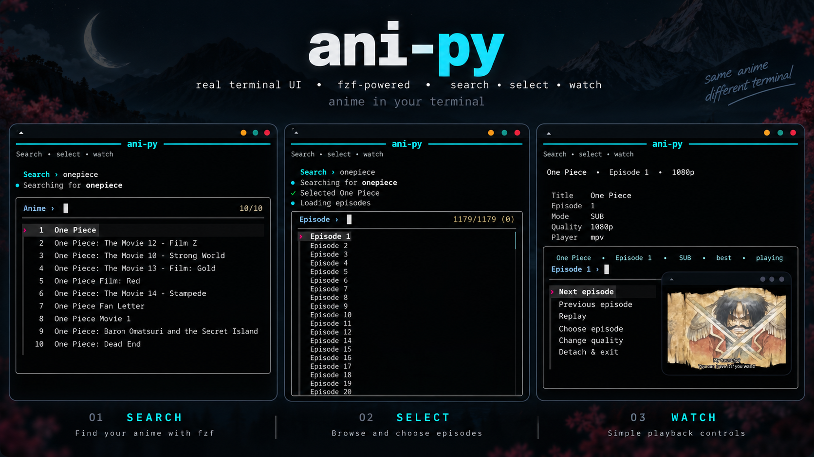
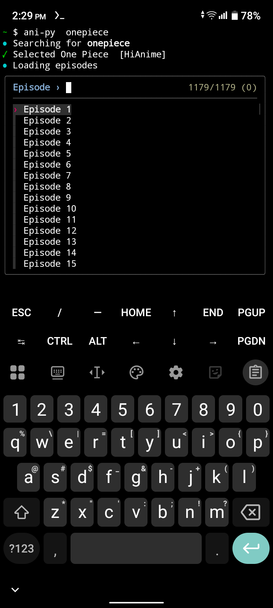
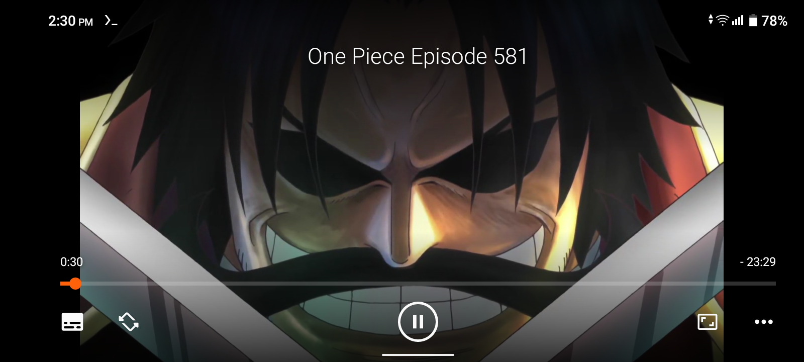
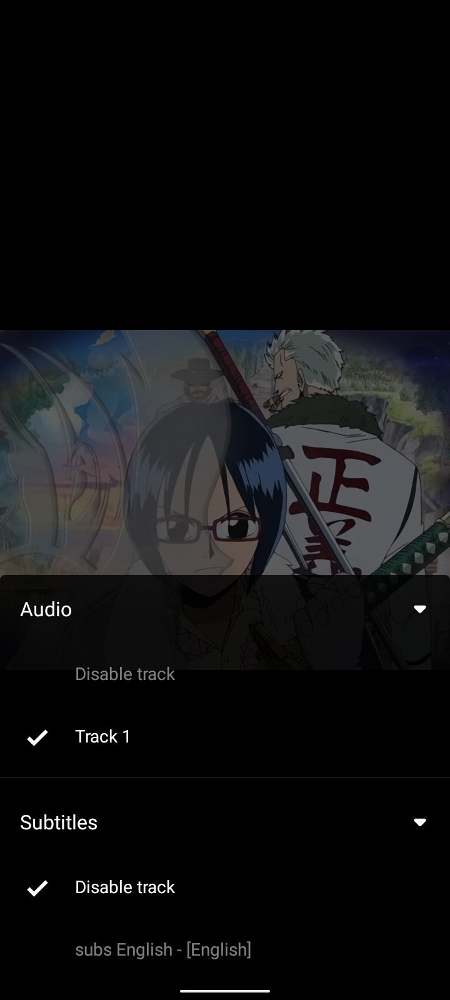
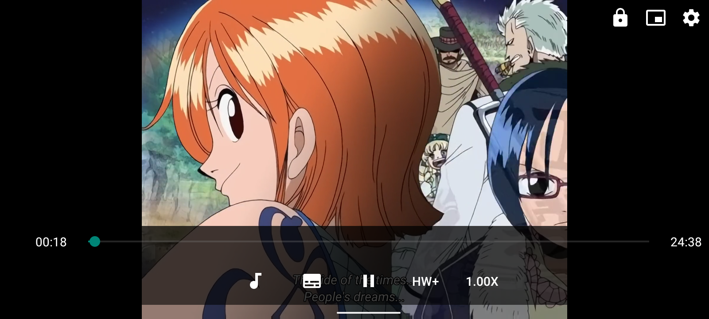
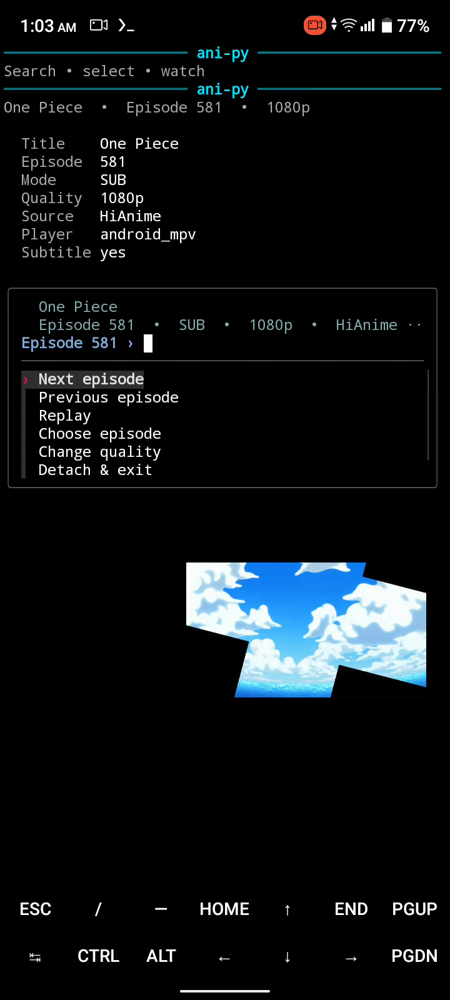

# ani-py




**ani-py** is a standalone Python CLI for searching, selecting, streaming, and downloading anime from the terminal. The Python runtime code uses only the standard library; external tools handle networking, menus, playback, and downloads.

It is an independent, AI-assisted implementation inspired by terminal anime launchers and is not affiliated with upstream `ani-cli`.

## Features

- Search and select anime from the terminal
- `fzf`, `rofi`, `dmenu`, or numbered fallback menus
- Single episodes or ranges such as `-e 3`, `-e 1-12`, `-e 0`, and `-e -1`
- Sub and dub modes
- Quality selection from available HLS variants
- Watch history and `--continue`
- mpv, VLC, IINA, and custom desktop players
- VLC for Android and mpv-android from Termux
- Android HLS relay for Referer-protected streams and subtitles
- Interactive next / previous / replay / episode / quality controls
- Private mpv IPC by default; existing global mpv sockets are left alone
- Downloads through `yt-dlp` with `ffmpeg` fallback
- Optional `ani-skip` integration for desktop mpv
- Provider-aware history and opt-in experimental provider adapters

## Install

### Linux / Unix

Install ani-py:

```sh
curl -fsSL https://raw.githubusercontent.com/Onehand-Coding/ani-py/main/install.sh | sh
```

Install recommended dependencies too when your package manager is supported:

```sh
curl -fsSL https://raw.githubusercontent.com/Onehand-Coding/ani-py/main/install.sh | sh -s -- --deps
```

The default Linux/Unix target is `~/.local/bin/ani-py`. Use `--prefix DIR` to choose another prefix.

Core requirements are Python 3.10+ and curl. `fzf` and mpv are recommended; VLC, rofi/dmenu, yt-dlp, ffmpeg, and ani-skip are optional.

### Termux / Android

The same installer detects Termux and installs to `$PREFIX/bin/ani-py`:

```sh
curl -fsSL https://raw.githubusercontent.com/Onehand-Coding/ani-py/main/install.sh | sh -s -- --deps
```

Install VLC for Android or mpv-android separately from your preferred Android app source. Shizuku/rish is optional and is **not** required.

### From a checkout

```sh
git clone https://github.com/Onehand-Coding/ani-py.git
cd ani-py
chmod +x ani-py
./ani-py "frieren"
```

Build the single-file distribution:

```sh
make build
./dist/ani-py -V
```

### Uninstall

```sh
curl -fsSL https://raw.githubusercontent.com/Onehand-Coding/ani-py/main/uninstall.sh | sh
```

The uninstaller removes ani-py only; it does not remove system packages or Android players.

## Usage

```sh
ani-py "frieren"
ani-py -q 1080 "dandadan"
ani-py -e 3 "one piece"
ani-py --dub -e 1-4 "bleach"
ani-py -c
ani-py -d -e 1-12 "pluto"
ani-py --skip "summer time rendering"
ani-py --list-providers
```

Useful player/menu examples:

```sh
ani-py -p vlc "frieren"                    # VLC
ani-py --menu rofi "frieren"
ani-py --menu dmenu "frieren"
ani-py -p mpv "frieren"                    # mpv
```

Run `ani-py --help` for the complete current option list.

## Termux / Android

```sh
ani-py "frieren"             # Android resolver/default player
ani-py -p vlc "frieren"      # VLC for Android
ani-py -p mpv "frieren"      # mpv-android
```

For streams that require provider headers, ani-py uses a loopback-only relay on `127.0.0.1`. It keeps Referer/User-Agent handling inside Termux and rewrites HLS requests through the relay.

WebVTT subtitles are attached to the relayed HLS stream as a native subtitle rendition. This has been live-tested on the project owner's device with both VLC for Android and mpv-android.

On the tested VLC 3.7.1 setup, English subtitles only auto-selected after adding this one-time VLC option:

```text
--sub-language=eng
```

VLC: **Settings → Advanced → custom libVLC options**, then restart VLC. This is a VLC preference observed on the tested device, not a requirement asserted for every VLC version.

For Android architecture, diagnostics, relay behavior, and limitations, see [docs/android.md](docs/android.md).

## Real Android usage

| Termux episode picker | VLC playback |
|---|---|
|  |  |
| VLC subtitle track | mpv-android playback |
|  |  |

More screenshots are in [docs/screenshots/android](docs/screenshots/android).

Recorded device flows:

[](docs/clips/android-flow-vlc.mp4)
[](docs/clips/android-flow-mpv.mp4)

## Providers

The default automatic provider chain is deliberately **HiAnime only**.

| Provider | Status | Default auto chain |
|---|---|---:|
| HiAnime | primary | yes |
| AniLight | experimental / opt-in | no |
| Kuhi | experimental / opt-in | no |
| AnimeKai | experimental / manual | no |

Examples:

```sh
ani-py --provider hianime "frieren"
ani-py --provider anilight "frieren"
ani-py --provider kuhi "frieren"
ani-py --provider-order hianime,anilight "frieren"
```

AniLight is registered as an experimental direct provider. The initial adapter
uses AniLight's current JSON API and its portable `ryu`/AnimeGG source path,
which returns quality-labelled progressive streams through AniLight's own proxy.
Sub and dub are supported where that source has coverage; the sub route is
hard-subbed. Broader soft-sub/MegaPlay backends are intentionally deferred until
their changing CDN/proxy behavior is proven against ani-py's desktop and Android
playback paths. AniLight is not part of the default automatic chain yet.

AnimeKai has no trusted default domain and requires an explicitly configured compatible mirror.

Provider availability changes independently of ani-py's mocked tests. See [docs/providers.md](docs/providers.md) for current policy and live-check guidance.

## Playback controls

After a normal single-episode launch, ani-py offers:

- Next episode
- Previous episode
- Replay
- Choose episode
- Search another anime
- Change quality
- Detach & exit
- Stop & quit

Desktop mpv uses a private JSON IPC socket and replaces the active item in place when possible. Multi-episode ranges run sequentially. `Search another anime` keeps the current player running while you search and replaces playback only after you choose a new title and episode.

## Downloads and skipping

Download:

```sh
ani-py -d -e 1 "frieren"
ANI_PY_DOWNLOAD_DIR="$HOME/Videos/anime" ani-py -d -e 1-3 "frieren"
```

ani-py prefers yt-dlp and falls back to `ffmpeg -c copy`. Provider Referer/User-Agent headers are passed to the download backend.

Intro/outro skipping is a desktop-mpv integration:

```sh
ani-py --skip "frieren"
```

ani-py calls `ani-skip -q <mal-id> -e <episode>` when the active provider exposes a MAL id. Android intent players, VLC, IINA, and generic custom players do not receive ani-skip mpv flags.

## Configuration

Common environment variables:

```text
ANI_PY_PLAYER
ANI_PY_PLAYER_FLAGS
ANI_PY_IPC_SOCKET
ANI_PY_MENU
ANI_PY_MENU_FLAGS
ANI_PY_DOWNLOAD_DIR
ANI_PY_HIST_DIR
ANI_PY_CURL
ANI_PY_PROVIDER
ANI_PY_PROVIDER_ORDER
ANI_PY_ANILIGHT_URL
ANI_PY_ANILIGHT_API_URL
ANI_PY_KUHI_URL
ANI_PY_ANIMEKAI_URL
ANI_PY_MODE
ANI_PY_QUALITY
ANI_PY_SKIP_INTRO
ANI_PY_NO_DETACH
ANI_PY_EXIT_AFTER_PLAY
ANI_PY_ANDROID_DEBUG
NO_COLOR
```

Use `--player-flag='--flag'` and `--menu-flags='--flag'` when a passthrough value itself begins with a dash.

## Development

```sh
make test
make build
```

CI checks Python 3.10, 3.11, 3.12, and 3.13. Automated tests mock external players/downloads and use local HTTP fixtures; real-device/provider acceptance is tracked separately.

See [docs/development.md](docs/development.md) for the release checklist and test/build notes.

## Troubleshooting

Check external tools:

```sh
./scripts/check-tools.sh
```

Android diagnostics:

```sh
ani-py --android-debug -p vlc -e 1 "frieren"
```

If mpv already uses `/tmp/mpvsocket`, no change is needed: ani-py uses a separate per-process IPC socket by default.

Provider failures should be checked against the specific provider and network; an offline parser test does not prove a third-party endpoint is live.

## Legal

Use ani-py in accordance with applicable law, provider terms, and your network environment.

## License

MIT
